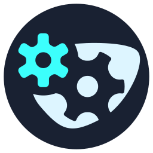

<i>"Living in a complicated world of IT pushing ideas further"</i>

- 
<a href="vemaiensi-profile.pages.dev"><strong>Portfolio Website</strong></a> -

 

<h3 align="center" >TECH STACK</h2>

---

 &nbsp &nbsp
   &nbsp &nbsp
   &nbsp &nbsp
   &nbsp &nbsp
   &nbsp &nbsp
   &nbsp &nbsp
   &nbsp &nbsp
   &nbsp &nbsp

   &nbsp &nbsp
   &nbsp &nbsp
    &nbsp &nbsp
    &nbsp &nbsp
    &nbsp &nbsp

    &nbsp &nbsp
   &nbsp &nbsp
  &nbsp &nbsp
   &nbsp &nbsp
     &nbsp &nbsp
     &nbsp &nbsp
   &nbsp &nbsp
   &nbsp &nbsp

 
